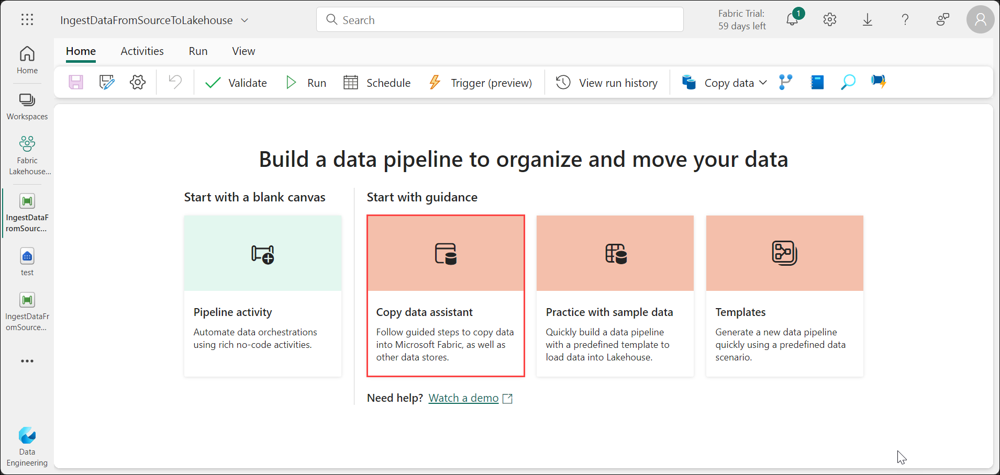
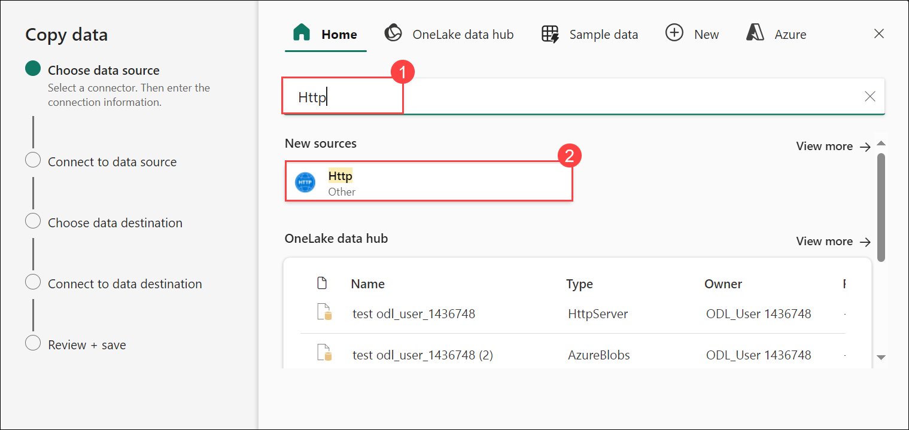
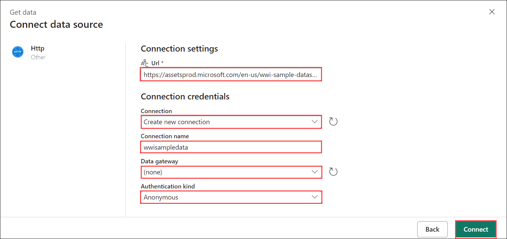
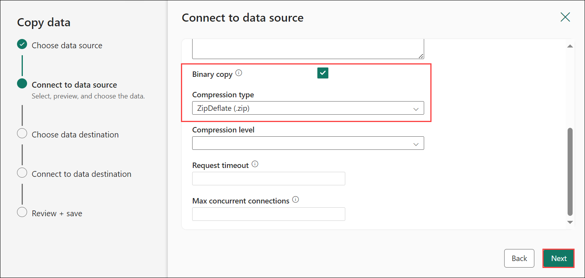
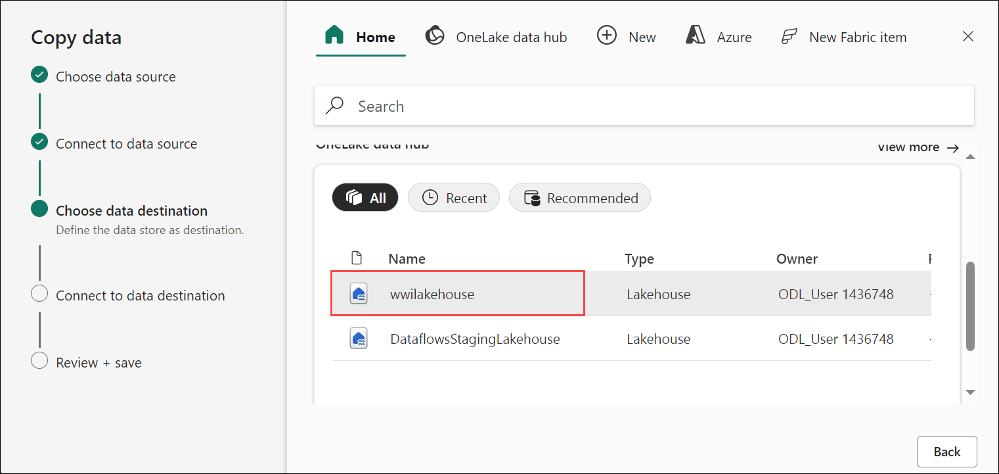
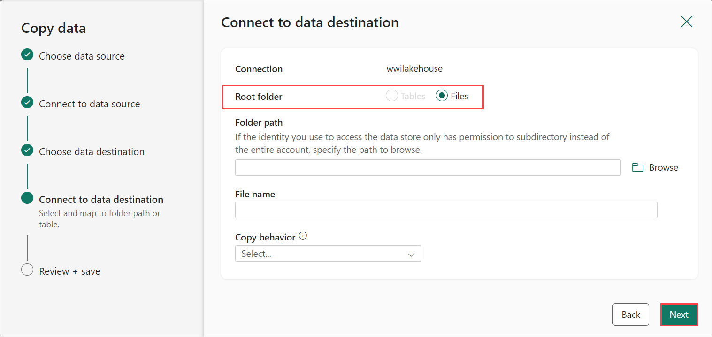
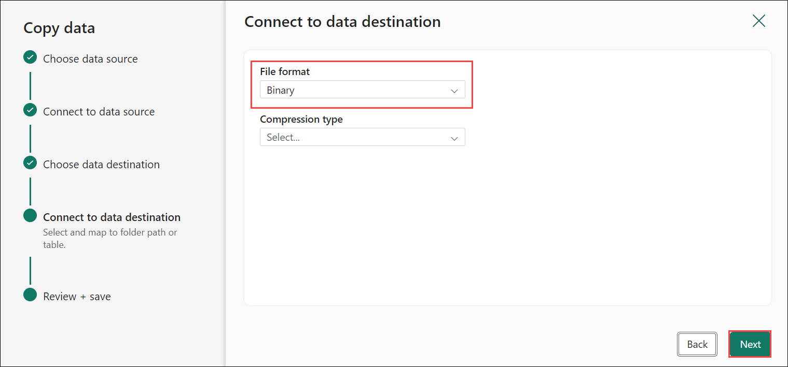
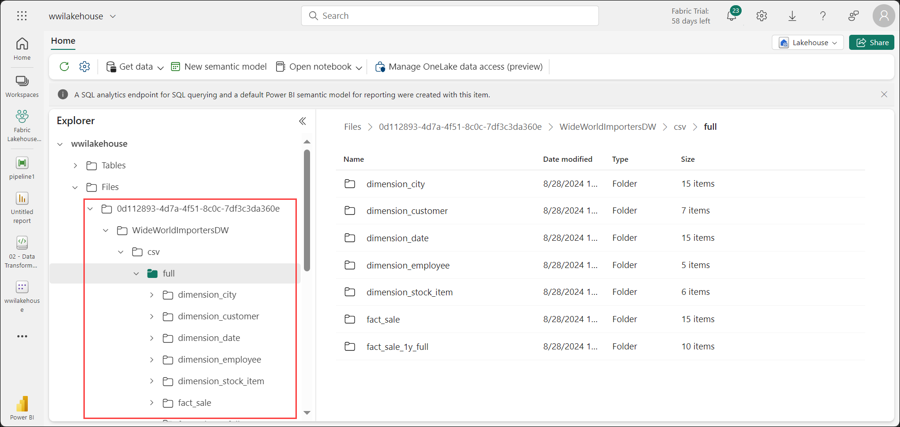

# Exercise 3: Ingest data into the lakehouse

### Estimated Duration : 1 Hour

In this exercise, you ingest additional dimensional and fact tables from the Wide World Importers (WWI) into the lakehouse.

## Objective

- Task 3.1: Ingest data

## Task 3.1: Ingest data

1. Open/Navigate back to the **Fabric Workspace**, click on the **+ New (1)** button and select **Data pipeline (2)**.

   

2. In the **New pipeline** dialog box, specify the name as **IngestDataFromSourceToLakehouse (1)** and select **Create (2)**. A new data factory pipeline is created and opened.

   

3. On your newly created data factory pipeline, select **Copy data assistant (1)** to add an activity to the pipeline.

   

4. Next, set up an HTTP connection to import the sample World Wide Importers data into the Lakehouse. From the list of Choose data sources, search for **Http (1)** and select **Http (2)**.

   

5. In the **Connect to data source** window, enter the details from the table below and select **Next**.

    | Property | 	Value |
    | -- | -- |
    | **URL** | `https://assetsprod.microsoft.com/en-us/wwi-sample-dataset.zip` |
    | **Connection** | **Create a new connection** |
    | **Connection name** | **wwisampledata** |
    | **Data gateway** | None |
    | **Authentication kind** | Anonymous |

   

5. In the next step, enable the **Binary copy** and choose **ZipDeflate (.zip)** as the **Compression type** since the source is a .zip file. Keep the other fields at their default values and click **Next**.

   

6. In **Choose data destination**, select your lakehous as **wwilakehouse**.

   

7. In the **Connect to data destination** window, specify the **Root folder** as **Files** and click **Next**. This will write the data to the Files section of the lakehouse.

   

8. Choose the **File format** as **Binary** for the destination. Click **Next** and then **Save+Run**. You can schedule pipelines to refresh data periodically. In this tutorial, we only run the pipeline once. The data copy process takes approximately 10-15 minutes to complete.
 
   

   

9. You can monitor the pipeline execution and activity in the Output tab. You can also view detailed data transfer information by selecting the glasses icon next to the pipeline name, which appears when you hover over the name

   

11. Now, navigate back to **Fabric workspace** and select **wwilakehouse** to launch **Lakehouse explorer**.

    

12. Validate that in the Lakehouse Explorer view, a new folder **wwi-raw-data** has been created and data for all the tables have been copied there.

    >**Note**: Refresh the Files section from the drop down. 

    

## Summary

In this exercise, you have completed ingesting data to the lakehouse.

